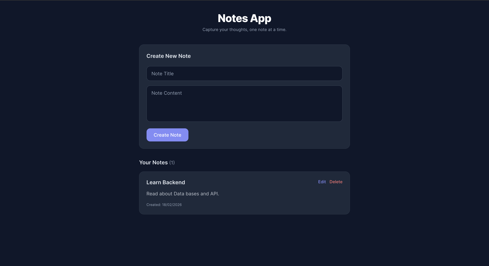
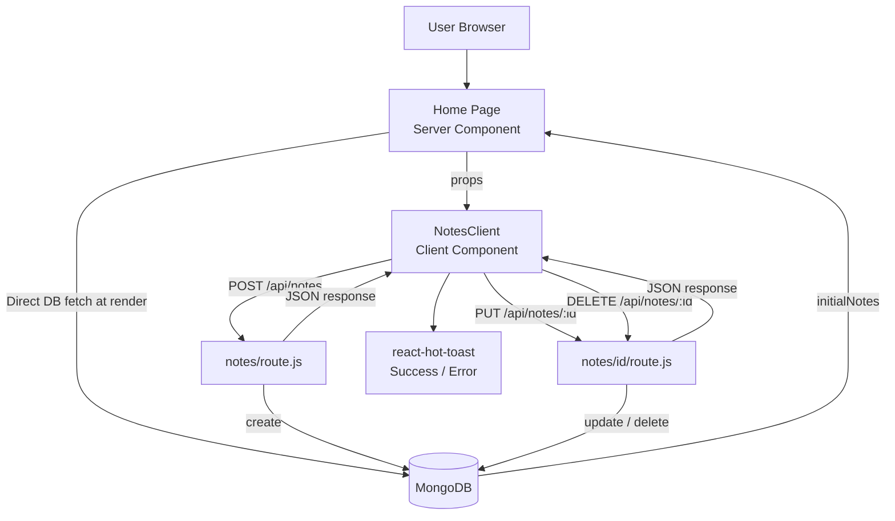

<h1 align="center">📝 Notes App</h1>

A clean, full-stack notes application built with **Next.js 16** and **MongoDB**. Create, edit, and delete personal notes with real-time toast notifications — powered by a traditional **REST API** approach using Next.js API Routes.

### Visit [Notes App](https://notes-app-gmarav05.vercel.app/)

---


## 📋 Overview

Notes App is a simple but production-ready note-taking application that demonstrates the classic **Next.js API Routes + Client-Side Fetch** pattern. Users can capture thoughts quickly, edit existing notes inline, and delete them — all with instant toast feedback. A solid foundation for understanding full-stack Next.js before moving to Server Actions.

---

## Live Demo


https://github.com/user-attachments/assets/9c96d8c1-9e6c-4c07-b2b5-3867c4c97190


## Screenshot




---

## 🌟 Features

### Core Functionality
- **Create Notes** — Add new notes with a title and content via a clean inline form.

- **View All Notes** — Displays all notes sorted newest-first, fetched at server render time.
- **Inline Editing** — Edit any note in-place without navigating to a separate page.
- **Delete Notes** — Remove notes instantly with a single click.
- **Toast Notifications** — Success and error feedback via `react-hot-toast` for every action.

### Technical Features
- **API Routes** — RESTful endpoints (`GET`, `POST`, `PUT`, `DELETE`) via `app/api/notes/`.

- **Server-Side Initial Fetch** — Notes are fetched directly from MongoDB at render time in the root Server Component, so the page arrives pre-populated with no loading flicker.
- **Client Hydration** — `NotesClient` takes `initialNotes` as props and manages local state for fast, optimistic interactions.
- **Mongoose Singleton** — Connection caching prevents duplicate connections across hot reloads in development.
- **React Compiler** — Enabled via `babel-plugin-react-compiler` for automatic memoization.

### UX Features
- **Responsive Design** — Mobile-first layout that adapts cleanly to all screen sizes.

- **Dark Mode** — CSS custom properties auto-switch via `prefers-color-scheme` media query.
- **Smooth Scrollbar** — Custom styled scrollbar for a polished feel.
- **Empty State** — Friendly message when no notes exist yet.
- **Loading States** — Buttons disable and show contextual text while requests are in-flight.

---

## 📚 Learnings

- Learned how **Next.js API Routes** work with dynamic segments like `[id]/route.js` for handling `PUT` and `DELETE` by ID.

- Understood the **hybrid data fetching pattern** — using a Server Component to pre-fetch initial data and passing it as props to a Client Component for interactivity.
- Practiced **Mongoose schema design** with `timestamps: true` for automatic `createdAt` / `updatedAt` fields.
- Implemented the **singleton DB connection pattern** using a module-level `isConnected` flag to avoid connection pool exhaustion.
- Learned how to manage **multi-field form state in React** using multiple `useState` hooks for create vs. edit flows simultaneously.
- Explored **conditional rendering** in JSX to toggle between view mode and edit mode per note card.
- Practiced **custom CSS theming** with CSS variables and `@theme inline` to bridge Tailwind v4 with design tokens for dark/light mode.

---

## 🏗️ Application Architecture



---

## 💻 Technology Stack

| Category | Technologies |
|----------|-------------|
| **Frontend Framework** | Next.js 16.1.6, React 19.2.3 |
| **Language** | JavaScript (JSX) |
| **Database** | MongoDB, Mongoose 9.2.1 |
| **Styling** | Tailwind CSS v4, PostCSS |
| **Notifications** | react-hot-toast 2.6.0 |
| **Build Optimization** | React Compiler (babel-plugin-react-compiler) |
| **Fonts** | Geist, Geist Mono via next/font |

---

## 📁 Project Structure

```
notes-app/
├── app/
│   ├── layout.js              # Root layout — fonts + Toaster setup
│   ├── page.js                # Home page (Server Component, fetches notes)
│   ├── globals.css            # CSS variables, dark mode, Tailwind import
│   └── api/
│       └── notes/
│           ├── route.js       # GET (all notes) + POST (create note)
│           └── [id]/
│               └── route.js   # PUT (update note) + DELETE (delete note)
├── components/
│   └── NotesClient.jsx        # Client component — all interactivity & state
├── lib/
│   └── db.js                  # Mongoose singleton connection
├── models/
│   └── Note.js                # Mongoose schema (title, content, timestamps)
├── public/                    # Static SVG assets
├── jsconfig.json              # Path aliases (@/*)
├── next.config.mjs            # Next.js config (React Compiler enabled)
├── postcss.config.mjs         # PostCSS + Tailwind v4 setup
└── package.json               # Dependencies
```

---

## 📊 Note Model Schema

```js
{
  title:     String   // Required, max 100 characters
  content:   String   // Required, max 2000 characters
  createdAt: Date     // Auto-generated (timestamps: true)
  updatedAt: Date     // Auto-updated  (timestamps: true)
}
```

---

## 🚀 Getting Started

### Prerequisites
- Node.js 18+
- A MongoDB connection string (MongoDB Atlas or local instance)

### Installation

```bash
# Clone the repository
git clone https://github.com/yourusername/notes-app.git
cd notes-app

# Install dependencies
npm install

# Set up environment variables
touch .env.local
```

### Environment Variables

Add the following to your `.env.local` file:

```env
MONGODB_URL=mongodb+srv://<user>:<password>@cluster.mongodb.net/notesapp
```

### Run the Development Server

```bash
npm run dev
```

Open [http://localhost:3000](http://localhost:3000) to see the app.

---

## 🔧 Available Scripts

| Command | Description |
|---------|-------------|
| `npm run dev` | Start development server with hot reload |
| `npm run build` | Build optimized production bundle |
| `npm start` | Start production server |
| `npm run lint` | Run ESLint for code quality |

---

## Acknowledgments

- [Next.js](https://nextjs.org/) for the App Router and API Routes
- [MongoDB Atlas](https://www.mongodb.com/atlas) for the managed database
- [Mongoose](https://mongoosejs.com/) for elegant MongoDB object modeling
- [react-hot-toast](https://react-hot-toast.com/) for beautiful toast notifications
- [Geist Font](https://vercel.com/font) by Vercel for the clean typography

##

<div align="center">

### 🛠️ Built With

**Next.js** • **React** • **MongoDB** • **Tailwind CSS** • **react-hot-toast**

Capture your thoughts, one note at a time.

</div>
